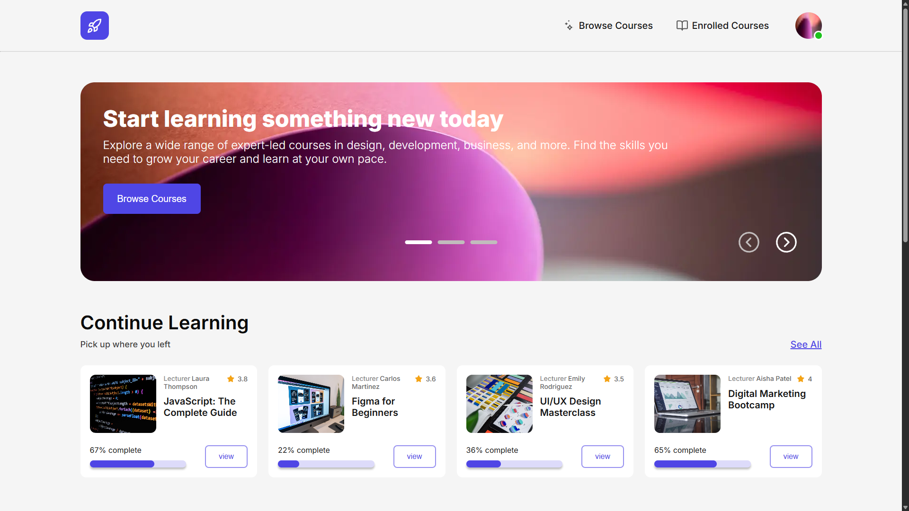
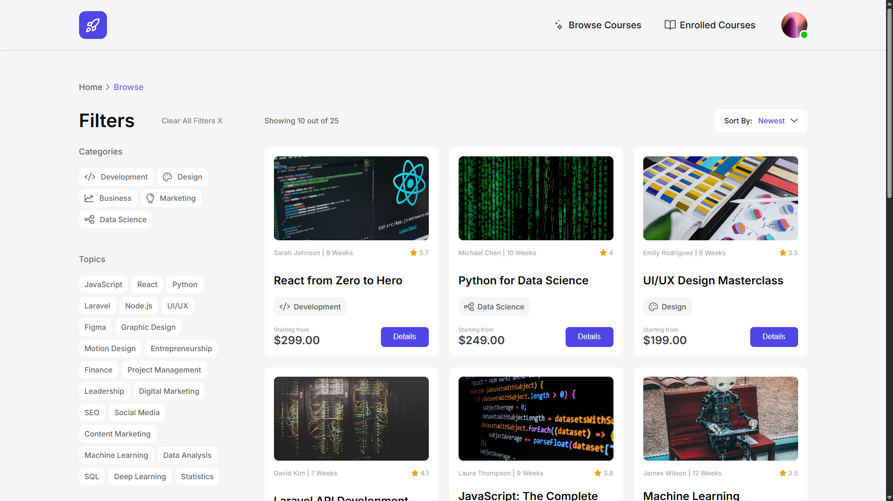
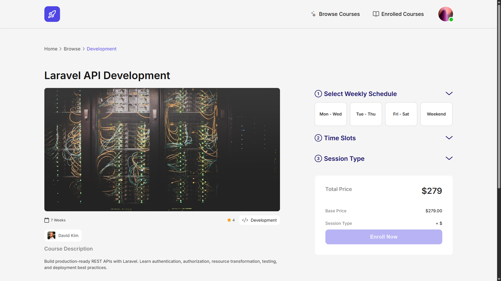
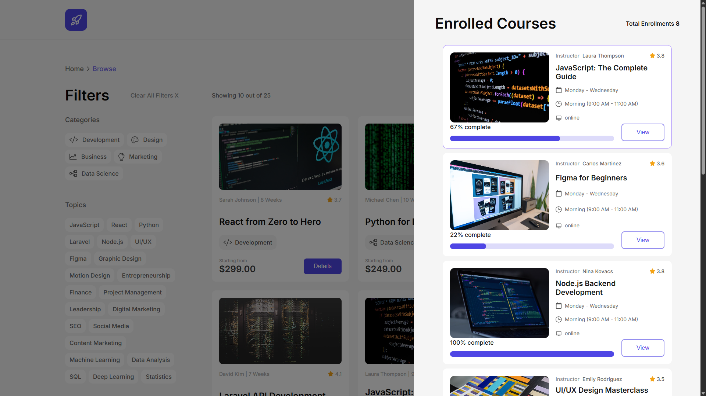
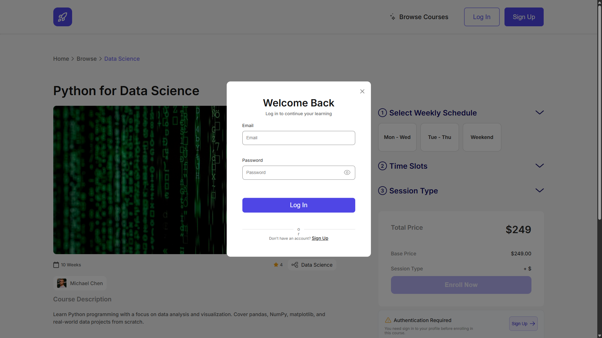
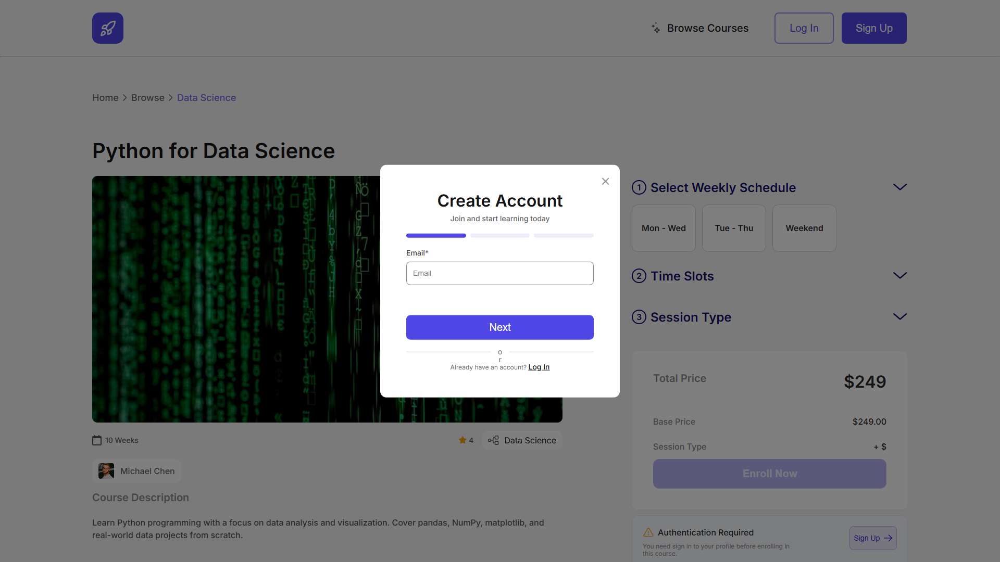

# RedBerry

A fully responsive online course platform built with Next.js and TypeScript. Features course browsing, enrollment with schedule selection, user authentication, and progress tracking.

🔗 **Live Demo:** [https://redberry-u9zb.vercel.app/]
---

## 📸 Screenshots

### Home Page


### Browse Page


### Course Detail


### Enrollment


### Login


### Signup


---

## 🧰 Tech Stack

- **Next.js**
- **TypeScript** — type safety across the entire codebase
- **Redux Toolkit** — global state management (userSlice, modalSlice)
- **SCSS Modules** — component-scoped nested styles

---

## ✨ Features

- **Home Page** — featured courses, continue learning section with progress tracking
- **Browse Page** — explore all available courses
- **Course Detail Page** — schedule selection, session type, enrollment with conflict detection, star rating
- **Authentication** — multi-step register (email → password → username/avatar), login with validation
- **Profile Modal** — update full name, phone, age, avatar with live validation, profile completion indicator
- **Enrollment Logic** — weekly schedule + time slot + session type selection, force enrollment on conflict

---

## 🧠 State Management

Two Redux slices:

- **userSlice** — stores authenticated user data, used for profile completion checks and access control
- **modalSlice** — controls which modal is active across the app

---

## 🚀 Getting Started

```bash
npm install
npm run dev
```

Open [http://localhost:3000](http://localhost:3000)

---

## 📝 Notes

- JWT token stored in `localStorage`
- Profile must be complete before enrolling in a course
- Schedule conflicts prompt a force enrollment confirmation
